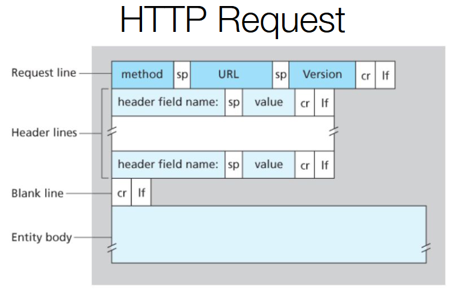

# Capa de aplicación

## Arquitecturas

Las arquitecturas más comunes son:

### Cliente-Servidor

Tenemos un servidor que provee un servicio y un cliente que lo consume.

### Peer-to-Peer

Tenemos una red de computadoras que se conectan entre sí sin la necesidad de un servidor central.

## Comunicación entre procesos

Para comunicar 2 procesos podemos ultizar sockets.

### Características que ofrece la capa de transporte

- Transmisión confiable
- Caudal / Throughput
- Sinconización
- Seguridad
- Con/Sin perdida de paquetes
- Conectado / No conectado

### Organismos normalizadores

- **W3C (World Wide Web Consortium)**: Organización que se encarga de estandarizar la web.
- **ITU (International Telecommunication Union)**: Organización que se encarga de estandarizar las telecomunicaciones. La participación es por país.
- **IETF (Internet Engineering Task Force)**: Organización que se encarga de estandarizar los protocolos de internet. Se encarga de crear las RFCs (Request for Comments) que son documentos que describen los protocolos de internet.

## Protocolos

### X.25

Es un protocolo muy primitivo que se utilizaba para la conmutación de paquetes. Se utilizaba para la transmisión de datos en redes de conmutación de paquetes. Este no solo se implementaba a nivel de software sino que también a nivel de hardware.

Hoy en día los protocolos de aplicaciones se implementan a nivel de software.

### HTTP

HyperText Transfer Protocol. Fue creado por unos investigadores del CERN que vino a reemplazar a Gopher que solo permitía texto plano.

Es un protocolo que utiliza el modelo cliente-servidor. Primeramente las peticiones eran NO persistentes, es decir, se abría una conexión, se enviaba la petición y se cerraba la conexión. Luego se creó el concepto de conexión persistente, donde se podía enviar varias peticiones en una misma conexión para evitar el overhead de abrir y cerrar conexiones.

Permite el texto formateado, imagenes, videos, etc. Se podría decir que es un protocolo de archivos.

Permitía cachear los recursos para evitar la sobrecarga de los servidores.

Los puertos más comunes se llaman "well known ports" y son el 80 para HTTP y el 443 para HTTPS por ejemplo.

Por defecto el HTTP 1.0 es NO persistente y el HTTP 1.1 es persistente. Se le puede indicar al servidor que cierre la conexión con la cabecera `Connection: close`.

La estructura de un mensaje HTTP es:



Con **telnet** podemos conectarnos de forma remota a un servidor y usarlo como terminal, haciendo por ejemplo peticiones HTTP. Normalmente esto ya no se deja abierto ya que todo el tráfico viaja en texto plano y esto es inseguro.

```bash
telnet www.google.com 80

GET / HTTP/1.1
Host: www.google.com
```

Por esto mismo se utiliza `SSH` que es un protocolo seguro que permite conectarse a un servidor de forma remota y encriptada.

### DNS

Domain Name System. Es un protocolo que se encarga de traducir los nombres de dominio a direcciones IP.

Escencialmente es una base de datos jerárquica y distribuida. Esto nos permite evitar tener una sola base de datos centralizada que se vuelva un cuello de botella o punto único de falla, distibuyendo la información en varios servidores.

Además provee otros servicios:

- **Host aliasing**: Un host puede tener varios nombres.
- **Mail server aliasing**: Un host puede tener varios servidores de correo.
- **Load distribution**: Se pueden tener varios servidores para un mismo nombre de dominio y se puede distribuir la carga entre ellos.
- **Replicated servers**: Se pueden tener varios servidores con la misma información para evitar el punto único de falla.

En la jeraquía de DNS tenemos:

- **Root servers**: Son los servidores raíz que se encargan de resolver las peticiones de los TLDs.
- **TLD servers**: Top Level Domain servers. Son los servidores que se encargan de resolver las peticiones de los dominios de primer nivel. Por norma tiene que haber al menos 2 servidores de TLDs. Normalmente hay muchos más.
- **Authoritative servers**: Son los servidores que tienen la información de los dominios.
- **Local DNS servers**: Son los servidores que tienen la información de los dominios de los clientes. También conocido como resolver.
- **Reverse DNS servers**: Son los servidores que se encargan de traducir direcciones IP a nombres de dominio.

Un ejemplo podría ser:

"www.fi.uba.ar."

Cabe aclarar que el punto al final no se escribe normalmente, pero representa el acceso al root server.

El punto simboliza la raíz de la jerarquía y se asociará a un root server. Luego "ar." se asociará a un TLD server. Luego "uba.ar." se asociará a un authoritative server. Y por último "fi.uba.ar." se asociará con otro authoritative server. Finalmente "www.fi.uba.ar." se asociará con el servidor que tiene la información del host.

"fi.uba.ar." es el dominio
"www" es el host en el dominio

Método de resolución:

- **Iterativo**: La computadora se contacta con el DNS local y este se contacta con el root server, luego el root server le devuelve la dirección del TLD server y el DNS local se contacta con el TLD server y así sucesivamente hasta llegar al authoritative server. Finalmente el DNS local le consulta al authoritative server la dirección IP del host y se la devuelve al cliente.
- **Recursivo**: La computadora se contacta con el DNS local este con el root server, el root con el TLD server, el TLD con el authoritative server y el authoritative server le devuelve la dirección IP al TLD, el TLD al root y el root al DNS local y el DNS local le devuelve la dirección IP al cliente.

Normalmente por un tema de recursos se utiliza el método iterativo, donde la única entidad recursiva es el DNS local que solo devuelve al cliente cuando tiene la respuesta.

Además el DNS guarda las respuestas en caché para evitar tener que hacer la misma consulta varias veces a todos los niveles de la jerarquía. Estos caches tienen un tiempo de vida que se llama TTL (Time To Live) que le dice hasta que tiempo la respuesta es válida para que no se quede desactualizada.

Se puede configurar en el DNS cuando se pregunta por el dominio a donde se redirige la consulta si no se tiene la respuesta, por ejemplo a "www". "www" es una convención que identifica que estamos contactando a un servidor web de un dominio en particular de un servidor.

También se pueden confirguar cualquier host en el servidor de DNS de más bajo nivel para que se redirija a un servidor web o la IP que yo quiera para un host en particular. Por ejemplo el servidor "fi" configurar "www" para tal IP y "abc" para otra IP.

Todas estas configuraciones se hacen vía registros en el servidor de DNS (RR) estos pueden ser:

- **A**: Address. Se utiliza para traducir un nombre de dominio a una dirección IP.
- **CNAME**: Canonical Name. Se utiliza para traducir un nombre de dominio a otro nombre de dominio.
- **MX**: Mail Exchange. Se utiliza para traducir un nombre de dominio a un servidor de correo.
- **NS**: Name Server. Se utiliza para traducir un nombre de dominio a un servidor de nombres.
