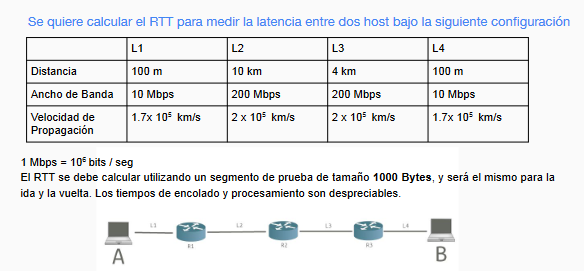

# Introducción

## Que es la internet

Es una red de redes que permite la comunicación entre computadoras de todo
el mundo.

## Tiers de la internet

En la internet existen 3 niveles de proveedores de servicios:

1. Tier 1: Son los proveedores de nivel superior que no compran ancho de banda a nadie.
2. Tier 2: Son los proveedores que compran ancho de banda a los Tier 1 y venden a los Tier 3.
3. Tier 3: Son los proveedores que compran ancho de banda a los Tier 2 y venden a los usuarios finales.

Por otro lado existen las conexiones P2P (Peer to Peer) que son conexiones directas entre dos computadoras.

Además de los tiers, existen los IXPs (Internet Exchange Points) que son puntos de intercambio de tráfico entre diferentes proveedores de servicios.

Por último distintas empresas multinacionales como Google, Facebook, Amazon, etc. tienen conexiones directas con los Tier 1 para mejorar la velocidad de sus servicios.

## Conectividad

Distintos dispositivos se pueden conectar a la internet de distintas maneras:

- **Unicast**: Es una conexión punto a punto. Es decir, un emisor y un receptor. Normalmente se utiliza un socket para establecer la conexión.
- **Broadcast**: Es una conexión de un emisor a toda la red.
- **Multicast**: Es una conexión de un emisor a múltiples receptores pero no a todos. Para esto se define un grupo de receptores.
- **Anycast**: Es una conexión de un emisor al receptor más cercano.

## Modelo TCP/IP

El modelo TCP/IP es un modelo de capas que se utiliza para la comunicación en la internet. Está compuesto por 5 capas.

Teóricamente las capas deberían estar aisladas y no depender unas de otras. En la práctica esto no es así.

### Capa Aplicación

Es la capa que interactúa con el usuario. Aquí se encuentran los protocolos HTTP, FTP, SMTP, etc. Todos estos protocolos suelen seguir el modelo cliente-servidor.

Normalmente de los primeros protocolos que se necesitan para establecer una conexión es el DHCP (Dynamic Host Configuration Protocol) que se encarga de asignar una dirección IP a un dispositivo.

Luego se necesita el DNS (Domain Name System) que se encarga de traducir un nombre de dominio a una dirección IP.

Finalmente una vez descubrimos la dirección IP del servidor que queremos contactar, se utiliza el protocolo HTTP (HyperText Transfer Protocol) para establecer la conexión o cualquier otro protocolo de la capa de aplicación.

### Capa Transporte

Es la encargada de armar los paquetes de información que se van a enviar. Aquí se encuentran los protocolos TCP y UDP. TCP es un protocolo orientado a la conexión y garantiza la entrega de los paquetes. UDP es un protocolo no orientado a la conexión y no garantiza la entrega de los paquetes, pero que tiene una ventaja en la velocidad de envío.

Se encarga de multiplexar y demultiplexar los paquetes de información.

### Capa Red

Es el encargado de direccionar los paquetes de información. Aquí se encuentra el protocolo IP que se encarga de asignar una dirección IP a un dispositivo. Además se encuentra el protocolo ICMP que se encarga de enviar mensajes de error y control.

Ocurre entre 2 dispositivos, 2 nodos, una computadora con un router, 2 routers, etc.

### Capa Enlace

Es la encargada de enviar los paquetes de información a través de la red. Aquí se encuentran los protocolos Ethernet, Wi-Fi, etc.

Estos son los protocolos que los distintos medios físicos utilizan para enviar los paquetes de información.

### Capa Física

Aquí se encuenta el hardware que se encarga de enviar los paquetes de información a través de la red. Por ejemplo, cables de red, cables coaxiales, fibra óptica, el aire en el caso de Wi-Fi, etc.

## Métricas de performance

### Latencia

Es una medida que mide cuanto tiempo tarda un paquete de información en llegar de un punto a otro. Se mide en milisegundos. Esta puede tener distintas causas:

- **delay de inserción/transmición**: Tiempo que tarda un router en encolar un paquete. Este se calcula como L/R donde L es el tamaño del paquete y R es la velocidad de serialización del router.
- **delay de procesamiento**: Tiempo que tarda un router en procesar un paquete y decidir a donde enviarlo. Tarda del orden de los nanosegundos.
- **delay de encolamiento/buffer**: Tiempo que espera un paquete en la cola del router. Se calcula como kL/$\lambda$ donde k es la longitud de la cola (una cte) y $\lambda$ es la tasa de encolamiento. Peeeero, no podemos calcularlos porque no sabemos el tráfico instantáneo de la red.
- **delay de propagación**: Tiempo que tarda un paquete en llegar de un punto a otro. Se calcula como D/S donde D es la distancia entre los dos puntos y S es la velocidad de propagación de la señal, por ejemplo la velocidad en la fibra óptica es de aproximadamente 2/3 de la velocidad de la luz (c).

Esta métricas es importante para aplicaciones en tiempo real como videollamadas, juegos online, etc.

### Pérdida de paquetes

Es una medida que mide cuantos paquetes de información se pierden en el camino. Esto puede ser por distintas causas:

- **Congestión**: Cuando un router no puede procesar todos los paquetes que recibe y los descarta (dropea) por ejemplo cuando llena la cola de paquetes (se queda sin espacio).
- **Errores**: Cuando un paquete se corrompe en el camino y no puede ser procesado. Ya sea por errores en el hardware o por interferencias en el medio físico.

Si L es el largo del paquete, a la tasa de arribo promedio de paquetes y R es la velocidad de serialización del router.

Si L*a > R entonces el router no puede procesar todos los paquetes que recibe y se llena la cola.

### Round Trip Time (RTT)

Es el tiempo que tarda un paquete en ir de un punto a otro y volver. Normalmente depende principalmente del delay de propagación ya que es el que mayor orden de magnitud tiene.

### Throughput

Es la cantidad de información que se puede enviar en un tiempo determinado. Se mide en bits por segundo.

### Ancho de banda vs Throughput

El ancho de banda es la capacidad máxima de información que se puede enviar por un medio físico. El throughput es la cantidad de información que se envía en un tiempo determinado.

### ADSL vs DSL

ADSL (Asymmetric Digital Subscriber Line) es una tecnología que utiliza la línea telefónica para enviar información. Es asimétrica porque la velocidad de subida es menor que la de bajada.

DSL (Digital Subscriber Line) es una tecnología que utiliza la línea telefónica para enviar información. Es simétrica porque la velocidad de subida es igual a la de bajada.

### Jitter

Es la variación en el tiempo de llegada de los paquetes. Es importante para aplicaciones en tiempo real como videollamadas, juegos online, etc.

Mide la fluctuación del retardo de los paquetes.

## Ejericio

L1:

- Distancia: 100m
- Ancho de banda: 10Mbps
- Velocidad de propagación: 1.7 x 10^5 km/s

L2:

- Distancia: 10km
- Ancho de banda: 200Mbps
- Velocidad de propagación: 2 x 10^5 km/s

L3:

- Distancia: 4km
- Ancho de banda: 200Mbps
- Velocidad de propagación: 2 x 10^5 km/s

L4:

- Distancia: 100m
- Ancho de banda: 10Mbps
- Velocidad de propagación: 1.7 x 10^5 km/s

Calculemos el RTT para un paquete de 1000 Bytes.

$$RTT = 2 * (dtL_1 + dtL_2 + dtL_3 + dtL_4 + dpL_1 + dpL_2 + dpL_3 + dpL_4)$$

- dp = delay de propagación
- dt = delay de transmisión
- L = enlace
- T = tamaño del paquete
- V = velocidad del enlace

$$dtL_i = T / V_i$$

$$dtL_1 = 1000B / 10Mbps = 8 x 10^3 bits / 10^7 bits/s = 8 x 10^-4 s = 0,8 ms$$

$$dtL_2 = 1000B / 200Mbps = 8 x 10^3 bits / 2 x 10^8 bits/s = 4 x 10^-5 s = 0,04 ms$$

$$dtL_3 = 1000B / 200Mbps = 8 x 10^3 bits / 2 x 10^8 bits/s = 4 x 10^-5 s = 0,04 ms$$

$$dtL_4 = 1000B / 10Mbps = 8 x 10^3 bits / 10^7 bits/s = 8 x 10^-4 s = 0,8 ms$$

$$dpL_i = D_i/S_i$$

$dpL_1 = 100m / (1.7 x 10^5 km/s) = (1,00 x 10^2 m) / (1.7 x 10^8 m/s) = 0,59 x 10^-6 s = 0,59 µs$

$dpL_2 = 10km / (2 x 10^5 km/s) = (1,00 x 10^4 m) / (2 x 10^8 m/s) = 0,5 x 10^-4 s = 0,05 ms$

$dpL_3 = 4km / (2 x 10^5 km/s) = (4,00 x 10^3 m) / (2 x 10^8 m/s) = 2 x 10^-5 s = 0,02 ms$

$dpL_4 = 100m / (1.7 x 10^5 km/s) = (1,00 x 10^2 m) / (1.7 x 10^8 m/s) = 0,59 x 10^-6 s = 0,59 µs$

$$RTT = 2 * (0,59µs + 0,05ms + 0,02ms + 0,59µs + 0,8ms + 0,04ms + 0,04ms + 0,8ms) = 2 * 1.75ms = 3,5ms$$

RTT = 3,5ms
