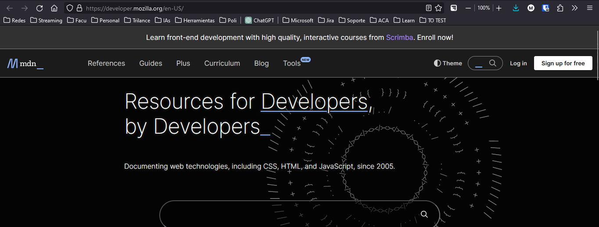
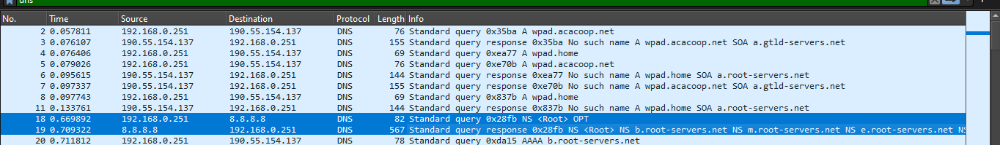
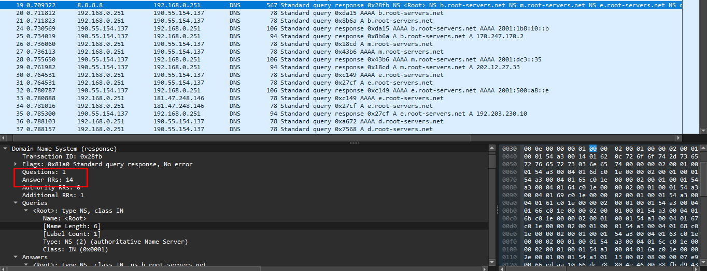
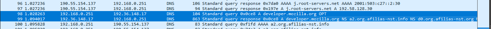
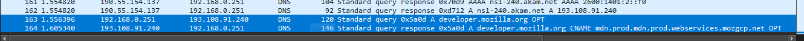
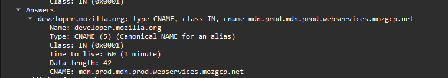
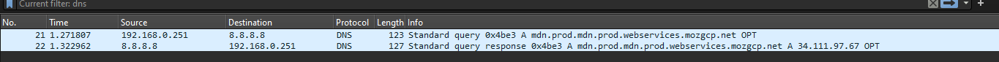
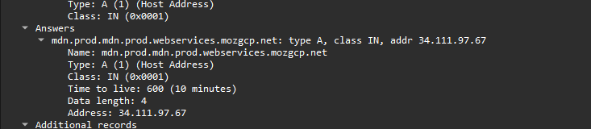

# Trabajo práctico dig

- Fecha de entrega: 7 de septiembre de 2024
- Materia: Redes (TA048)
- Curso: 02 Alvalrez Hamelin
- Nombre completo: Máximo Gismondi
- Padrón: 110119

## Consigna

Usar el comando “dig" con las opciones iterativa, autorizada y verborrágica capturando por la pantalla de la terminal y también mediante "Wireshark". Subirlo al Campus un informe en formato PDF.

## Introducción

En este trabajo práctico, nos vamos a centrar en la utilidad `dig` (Domain Information Groper). Esta utilidad permite realizar consultas a servidores DNS, proporcionando a los administradores de redes la capacidad de depurar la resolución de nombres de dominio y analizar el funcionamiento del protocolo DNS en situaciones específicas.

En esta ocasión, utilizaremos `dig` para consultar el servidor DNS asociado a `developer.mozilla.org`, un sitio que ofrece guías, referencias y herramientas principalmente para desarrolladores web. Analizaremos la traza de consultas, los servidores que responden, y otros detalles no solo a través de la línea de comandos, sino también con Wireshark, una aplicación que permite capturar y analizar cualquier tipo de paquete de red. de red.

## Comando

Antes de empezar a enviar consultas a través de `dig`, vamos a entender como funciona el comando y la estructura del mismo. `dig` tiene la siguiente estructura:

```bash
dig [@server] [name] [type] [+opciones]
```

Donde:

- `@server`: Especifica el servidor DNS al que se le enviará la consulta. Si no se especifica, se utilizará el servidor DNS configurado en el sistema.
- `name`: Es el nombre de dominio que se desea consultar.
- `type`: Especifica el tipo de registro que se desea consultar. Si no se especifica, se asume que es un registro de tipo `A`.
- `+opciones`: Son opciones adicionales que se pueden utilizar para modificar el comportamiento de la consulta.

### Opciones

Para hacer una consulta iterativa, autorizada y verborrágica debemos utilizar las siguientes opciones:

- `+trace`: Realiza una consulta iterativa, mostrando la traza de consultas desde el servidor raíz hasta el servidor autoritativo.
- `+stats`: Muestra estadísticas de la consulta realizada.
- `+multiline`: Muestra la respuesta en formato de múltiples líneas.

No es necesario utilizar otras opciónes ya que al usar `+trace` siempre se realiza una consulta iterativa y autorizada. Y la información adicional que se puede obtener con `+stats` y `+multiline` es suficiente para analizar la consulta ya que el modo verborrágico está activado por defecto.

### Servidor DNS

El servidor DNS que vamos a utilizar para realizar la consulta es `8.8.8.8`, el servidor DNS público de Google, que es muy utilizado por su velocidad y disponibilidad.

### Tipo de registro

El tipo de registro que vamos a consultar es `A`, que es el tipo de registro que nos permitirá obtener la dirección IP asociada al nombre de dominio y acceder al sitio web.

### Comando completo

Una vez que entendemos la estructura y las opciones que vamos a utilizar, el comando completo para realizar la consulta es el siguiente:

```bash
dig @8.8.8.8 developer.mozilla.org +trace +stats +multiline
```

## Captura por terminal

### Salida

Ejecutamos el comando en la terminal y redirigimos la salida a un archivo de texto para poder analizarla con más detalle. En el archivo `salida.txt` se encuentra la salida completa de la consulta.

### Análisis de la salida

Como dijimos, estaremos realizando una consulta iterativa y autorizada, por lo que la salida de la consulta se divide en varias partes. A continuación, analizaremos cada una de las partes de la salida:

1. **Consulta a los servidores raíz**: La primera parte de la salida muestra la consulta realizada a los servidores raíz para obtener la dirección de los servidores DNS autoritativos asociados al dominio `org.`.

    ```txt
    .   87203 IN NS e.root-servers.net.
    .   87203 IN NS d.root-servers.net.
    .   87203 IN NS c.root-servers.net.
    .   87203 IN NS b.root-servers.net.
    .   87203 IN NS j.root-servers.net.
    .   87203 IN NS f.root-servers.net.
    .   87203 IN NS l.root-servers.net.
    .   87203 IN NS h.root-servers.net.
    .   87203 IN NS k.root-servers.net.
    .   87203 IN NS m.root-servers.net.
    .   87203 IN NS i.root-servers.net.
    .   87203 IN NS g.root-servers.net.
    .   87203 IN NS a.root-servers.net.
    ```

    Esta consulta está firmada con RRSIG para verificar la autenticidad de la respuesta.

    ```txt
    .   87203 IN RRSIG NS 8 0 518400 (
            20240920050000 20240907040000 20038 .
            U49XcWjPsd5CGorijfDO33h3G+/3Nd2svHCIx6OKUzrk
            46UMIU3B9PbmOs/YCAUVvmD7gj4ZqOk+rXdGEUcysddn
            /oMRtNtIeNe92RwerClE8cUY3Klzulx3rlDghB5W7VlX
            3sy0l0U7XuA7alSrHmB3tNWQzvXzErbMudKsOW+utzfQ
            1nYYGBDolFrezaxm+sjHW1/+Mju5sXy5oXACr1ifq9TN
            uFCHfw6UcEW+wXd6MRjGfSdBPod5/bVgMg0hmbpVZ3gB
            u5eqwdBWpBRHQs+GuYlzh6PtJg7Z3W/6ZuCHd4YmoyBv
            W8Wm2ydUmbVSjiFeL9C6u9Ig2TFk/E10tQ== )
    ```

2. **Consulta a los servidores de nivel superior**: Luego de obtener la dirección de los servidores nivel superior asociados al dominio `org.`, necesitamos saber la dirección de los servidores autoritativos asociados al dominio `mozilla.org.`.

    ```txt
    org.    172800 IN NS a0.org.afilias-nst.info.
    org.    172800 IN NS b0.org.afilias-nst.org.
    org.    172800 IN NS c0.org.afilias-nst.info.
    org.    172800 IN NS d0.org.afilias-nst.org.
    org.    172800 IN NS a2.org.afilias-nst.info.
    org.    172800 IN NS b2.org.afilias-nst.org.
    org.    172800 IN NS c2.org.afilias-nst.info.
    org.    172800 IN NS d2.org.afilias-nst.org.
    org.    172800 IN NS a1.org.afilias-nst.info.
    org.    172800 IN NS b1.org.afilias-nst.org.
    org.    172800 IN NS c1.org.afilias-nst.info.
    org.    172800 IN NS d1.org.afilias-nst.org.
    ```

    Nuevamente firmada la respuesta para verificar la autenticidad de la misma.

    ```txt
    org.    86400 IN RRSIG DS 8 1 86400 (
            20240920050000 20240907040000 20038 .
            nw5DAysKQIL8XsOuznoeNjl6xG08XqPtWQID/ZeS5T8j
            5xgASM2QuykM9OCNpRY2EPq++5UrkNHxK3g8YIjkezbp
            JDJ+i7U1HGQINoEsh9VX0y0jsX0oKYkoAmfOl5SjIfx2
            ARiHW2h7gTvnRtEihLV23mpJaiaDPAxRdE5MEKmkmKEk
            3l/jR7T3bvuL9FYcCnXCvK6IQpy1yeCUBGGb8+fr9Xbj
            RYdBmeVrql8EDQCXo25SfkTgIN/deQy+bIYZl0pY7iMH
            epood2sZB/NeqPaUvbG4WROUCxgfjue+oos0oZTJT1TA
            wpuUMGWHne8Ju6qm/8vsxRU19UukFAXTQA== )
    ```

3. **Consulta a los servidores autoritativos**: Una vez que tenemos la dirección de los servidores autoritativos, asociados a `mozilla.org.`, realizamos la consulta a estos servidores para obtener que servidores DNS saben responder por el dominio `developer.mozilla.org.`.

    ```txt
    mozilla.org.  3600 IN NS ns5-65.akam.net.
    mozilla.org.  3600 IN NS ns1-240.akam.net.
    mozilla.org.  3600 IN NS ns4-64.akam.net.
    mozilla.org.  3600 IN NS ns7-66.akam.net.
    ```

4. **Consulta final al servidor autoritativo**: Finalmente, realizamos la consulta al servidor autoritativo para obtener la dirección IP asociada al nombre de dominio `developer.mozilla.org.`.

    ```txt
    developer.mozilla.org. 60 IN CNAME mdn.prod.mdn.prod.webservices.mozgcp.net.
    ```

    Esto nos está indicando que el nombre de dominio `developer.mozilla.org.` en realidad es un alias (CNAME) que apunta a otro nombre de dominio `mdn.prod.mdn.prod.webservices.mozgcp.net.`.

    Esto signfica que si realmente queremos obtener la dirección IP asociada al nombre de dominio `developer.mozilla.org.`, debemos realizar una nueva consulta a este nuevo nombre de dominio.

5. **Consulta adicional**: En este caso podemos realizar la consulta de forma iterativa, es decir, realizar una nueva consulta al servidor autoritativo asociado al nombre de dominio `mdn.prod.mdn.prod.webservices.mozgcp.net.` para obtener la dirección IP asociada al nombre de dominio `developer.mozilla.org.`. Pero como el proceso es el mismo, podemos pasar directamente a la consulta final y obtener la dirección IP.

    Para eso podemos hacer la siguiente consulta:

    ```bash
    dig @8.8.8.8 mdn.prod.mdn.prod.webservices.mozgcp.net +short
    ```

    La opción `+short` no elimina la información adicional dejando solo que nos interesa, en este caso la dirección IP asociada al nombre de dominio `mdn.prod.mdn.prod.webservices.mozgcp.net.` y por ende al nombre de dominio `developer.mozilla.org.`.

    ```txt
    mdn.prod.mdn.prod.webservices.mozgcp.net. 174 IN A 34.111.97.67
    ```

    Por lo que la dirección IP asociada al nombre de dominio `developer.mozilla.org.` es `34.111.97.67` y con esta dirección IP podemos acceder al sitio web.

### Información adicional

Además de la información seleccionada, dig nos muestra información adicional sobre la consulta realizada, como las estadísticas de la consulta, los servidores que respondieron, los tiempos de respuesta, los tamaño de los paquetes, entre otros. Muy buena información para comprender lo que realmente comprende la consulta.

### Ingreso al sitio web




El navegador me hace directamente la traducción de la IP a la URL del sitio web.

## Captura de Wireshark

Si ejecutamos el comando mientras hacemos una captura de los paquetes, podremos ir viendo en tiempo real cómo se realizan las consultas y las respuestas de los servidores DNS. Para esto simplemente empezamos a capturar y cortamos al finalizar la consulta.

Una vez que tenemos la captura, podemos filtrar los paquetes para ver solo los relacionados con la consulta DNS. Para esto utilizamos el filtro `dns` en la barra de filtros de Wireshark.



Lo primero que observamos es la consulta al servidor DNS de Google dondee hacemos la consulta por los DNS raíz y nos devuelve el registro NS de cada uno de ellos junto con la firma RRSIG. Por eso las 14 respuestas.



Luego podemos revisar las consultas a los servidores de nivel superior y los servidores autoritativos.




Finalmente, podemos ver la consulta al servidor autoritativo y la respuesta con la dirección IP asociada al nombre de dominio `developer.mozilla.org.`.





Como vemos la respuesta final, nos indica que el nombre de dominio `developer.mozilla.org.` es un alias como habíamos visto anteriormente y que apunta a otro nombre de dominio `mdn.prod.mdn.prod.webservices.mozgcp.net.`.

Hasta acá llega la consulta de `dig`, pero como vimos anteriormente, podemos realizar una nueva consulta para obtener la dirección IP asociada al nombre de dominio `mdn.prod.mdn.prod.webservices.mozgcp.net.` y por ende al nombre de dominio `developer.mozilla.org.`.





Como vemos, obtenemos la misma IP que habíamos obtenido anteriormente por consola: `34.111.97.67`.

Acá termina la consulta y podemos ver todo el proceso de resolución de nombres de dominio a través de la captura de Wireshark en el archivo `wireshark.pcapng` y `wireshark_adicional.pcapng`. Tenemos muchas más consultas intermedias a los servidores DNS y las respuestas correspondientes. Entre ellas todos los servidores raíz que terminamos ignorando ya que otros respondieron antes.

## Conclusión

Dig es una utilidad muy interesante para entender y depurar el funcionamiento del protocolo DNS. Nos permite realizar consultas de forma iterativa y autorizada, obteniendo información detallada sobre los servidores que responden a nuestras consultas y los registros asociados a los nombres de dominio.

Particularmente esta dirección a consultar era una dirección especial ya que no nos devolvía directamente la dirección IP asociada al nombre de dominio sino un alias al que debíamos consultar para obtener la dirección IP final. Este ejemplo nos permitió entender más en profundidad el orden en el que el protocolo DNS resuelve las consultas y cómo se realiza la resolución de nombres de dominio en la práctica.

Por último, la captura de Wireshark nos enseña que es realmente una herramienta muy poderosa para cualquier administrador de red o ingeniero. Nos permite ver bit a bit todo el tráfico de la computadora y aunque a primera vista a veces no se entienda mucho, podemos excavar (dig :D) en los paquetes y entender las comunicaciones que se están realizando en la red.

Como comentario personal, me sorprende la velocidad con la que se resuelven las consultas DNS y estoy convencido que aunque no probe mucho el uso de las respuestas cacheadas, es un gran ahorro de tiempo y recursos para el internet en general.

## Bibliografía

- [IBM dig command](https://www.ibm.com/docs/pl/aix/7.1?topic=d-dig-command): me permitió entender la estructura del comando `dig` y las opciones que se pueden utilizar.
