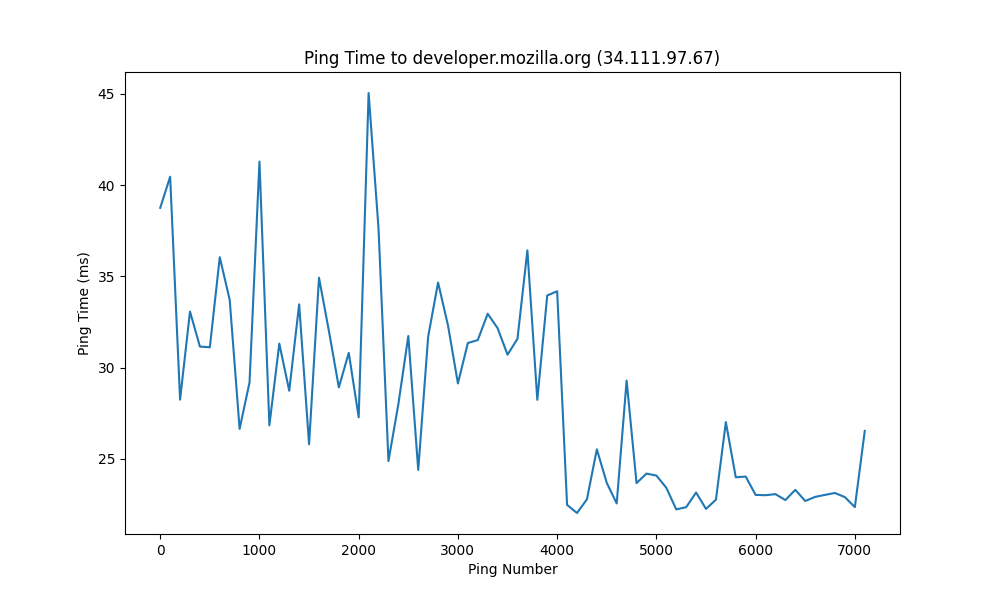
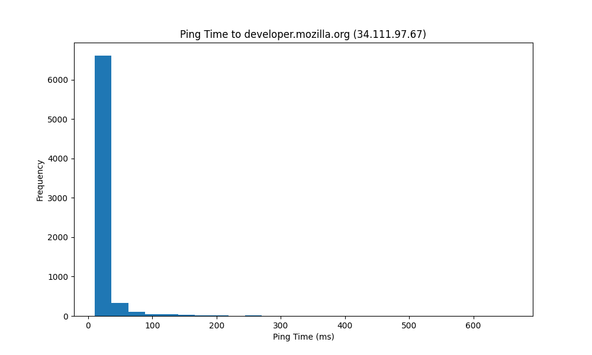
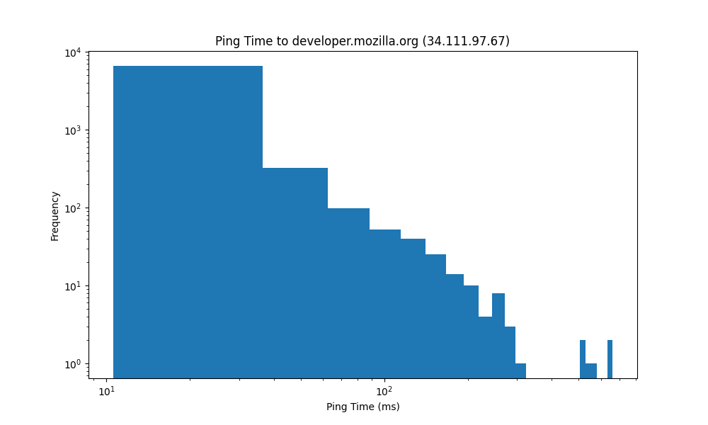

# Análisis estadístico de los tiempos de RTT con ping

## Introducción

El comando `ping` es una herramienta que se utiliza para comprobar la conectividad entre dos dispositivos de una red. Para ello, envía paquetes de datos a un host y espera a que este responda. La respuesta del host se mide en términos de tiempo de ida y vuelta (RTT), que es el tiempo que tarda un paquete en llegar al host y volver al emisor.

En este informe, se analizarán los tiempos de RTT obtenidos al realizar un ping a un host determinado. Se graficarán los tiempos de RTT en función del tiempo y se calcularán algunas estadísticas descriptivas.

## Desarrollo

### Comando utilizado

Para realizar el ping al host, se utilizó el siguiente comando:

```bash
ping -c 7200 -i 1 -D developer.mozilla.org > ping_output.txt &
```

Donde:

- `-c 7200`: envía 7200 paquetes de datos al host.
- `-i 1`: espera 1 segundo entre cada paquete.
- `-D`: imprime la marca de tiempo en cada línea de salida.
- `developer.mozilla.org`: host al que se envían los paquetes.
- `> ping_output.txt`: redirige la salida del comando a un archivo llamado `ping_output.txt`.
- `&`: ejecuta el comando en segundo plano.

Como enviamos 7200 paquetes de datos con un intervalo de 1 segundo, el comando se ejecutó durante aproximadamente 2 horas.

### Análsis de los tiempos de RTT

Los resultados obtenidos se encuentran en el archivo `ping_output.txt`. A continuación, se muestra la evolución de los tiempos de RTT en función del tiempo:



Para cada punto en el gráfico se calculo el promedio entre los 100 valores posteriores al mismo para suavizar la curva y poder visualizar mejor la tendencia.

Como podemos ver, hay bastante variabilidad en los tiempos de RTT desde un rango promedio de 10ms a 50ms. Esto puede deberse a muchos factores, desde la congestión de la red hasta la carga del host de destino.

A su vez podemos ver como llegando a la segunda hora los tiempos se reducieron mucho, esto puede deberse a que el host bajo mucho su carga o que la red en ese periodo, aunque esto es puramente especulativo.

### Variables estadísticas

Al final de la salida del comando `ping`, se muestran algunas estadísticas descriptivas de los tiempos de RTT:

- **Packet transmitted:** 7200
- **Packet received:** 7200
- **Packet loss:** 0.0%
- **Total time:** 7212733.0 ms
- **RTT Min:** 10.645ms
- **RTT Avg:** 28.369ms
- **RTT Max:** 660.327ms
- **RTT Mdev:** 26.176ms

Podemos ver que no tuvimos perdida de paquetes, lo cual destaca las excelentes condiciones de la red en la que se realizo el ping. A su vez tenemos un RTT promedio de 28.369ms con un desvio estandar de 26.176ms, lo cual nos indica que los tiempos de RTT son bastante variables y no se encuentran muy concentrados alrededor del promedio. Por último observamos que el RTT máximo fue de 660.327ms, lo cual es un valor bastante alto en comparación con el promedio y si hubiera llegado al segundo es muy probable que se hubiera considerado como una pérdida de paquete.

El siguiente gráfico muestra la distribución de los tiempos de RTT:



Se puede ver que se concentran mucho los resultados en los primeros 100 milisegundos, lo cual es congruente con el promedio y la desviación estandar obtenidos.

Por otro lado este gráfico nos muestra la distribución de los tiempos de RTT en una escala log-log:



En este gráfico se resaltan mucho más los valores más bajos y altos de RTT, lo cual nos visualizar mejor la existencia de valores fuera de lo común.

De todas formas se respeta la tendencia de concentración de valores en los primeros 100 milisegundos pero se evidencia la existencia de tiempos por arriba de este valor que no se apreciaban en el gráfico anterior.

### Conclusiones

Podemos concluir que el análisis de los tiempos de RTT obtenidos al realizar un ping a un host determinado nos permite conocer la calidad de la conexión entre los dispositivos y detectar posibles problemas en la red. En este caso, se observó que la conexión entre ambos hosts es muy buena, los tiempos de RTT son bajos y no son extremadamente variables. Aún así se puede determinar que los hosts no se encuentran particularmente cerca uno del otro ya que los tiempos de RTT son del orden de los 10-100 milisegundos por lo que se deduce que no se encuentran en la misma ciudad ni mucho menos en la misma red local.

Por úlitmo la distribución nos expuso que el gran porcentaje de los tiempos de RTT se encuentran en los primeros 100 milisegundos, lo cual es un valor bastante bueno pero la escala logarítmica nos mostró que tiempos por encima de este existen a pesar de la rareza de los mismos llegando a los 660 milisegundos como indicaban las estadísticas del comando `ping`.
