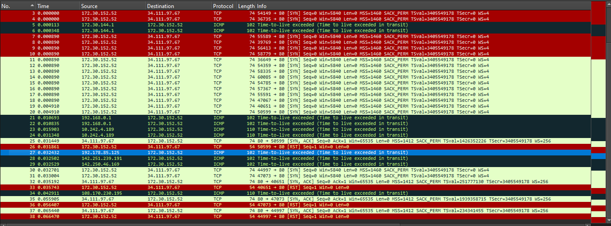
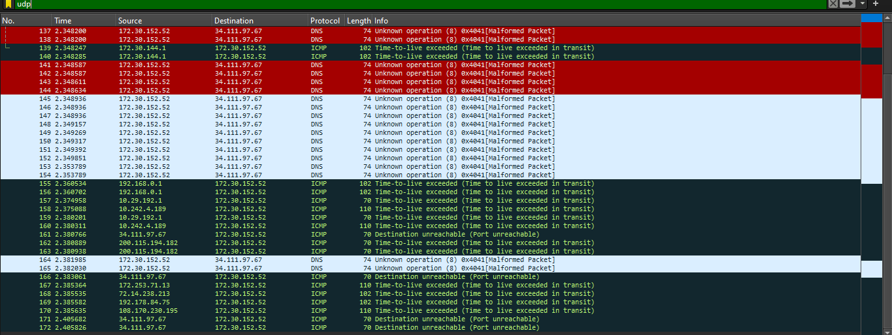

# ICMP: traceroute en Wireshark

## Consigna

Realizar un captura con el Wireshark de traceroute (si puede en IPv6) con las opciones TCP y luego con UDP, y realizar un informe en PDF.

## Introducción

El comando `traceroute` es una herramienta que se utiliza para seguir la traza que hace un paquete a través de la red. Para ello, envía paquetes IP con el campo TTL (Time To Live) incrementado en 1 en cada iteración. En cada iteración, el paquete se envía multiple veces y se espera a que el host de destino responda con un mensaje ICMP de tipo "Time Exceeded". Cuando el host (router) responde, este informa la dirección IP del mismo y nos permite reconstruir la ruta que siguió el paquete. Por otro lado para asegurarse de que el paquete llegue al host de destino, se usa un puerto que probablemente esté cerrado en el host de destino, de esta forma el host de destino responderá con un mensaje ICMP de tipo "Port Unreachable" y el comando `traceroute` sabrá que llegó al host de destino.

## Desarrollo

### Comando utilizado

Para realizar el traceroute al host, se utilizó el siguiente comando:

```bash
sudo traceroute -T -4 -q N developer.mozilla.org > traceroute_output_tcp.txt

traceroute -U -4 -q N developer.mozilla.org > traceroute_output_udp.txt
```

Donde:

- `sudo`: se utiliza para ejecutar el comando con permisos de superusuario (necesario para el caso de TCP).
- `traceroute`: comando utilizado para seguir la traza de un paquete a través de la red.
- `-T`: utiliza TCP como protocolo de transporte.
- `-U`: utiliza UDP como protocolo de transporte.
- `-4`: utiliza IPv4 (hice la prueba con IPv6 y no lo admite el destino).
- `-q N`: envía N paquetes de datos al host por cada TTL.
- `developer.mozilla.org`: host al que se envían los paquetes.
- `> output.txt`: redirige la salida del comando a un archivo.

Para hacer una prubea inicial, usamos `N=2` para hacer una primera prueba y asegurarnos de que el comando funciona correctamente.

### Análisis de los resultados - TCP

```bash
traceroute to developer.mozilla.org (34.111.97.67), 30 hops max, 60 byte packets
 1  N-MGISMONDI.mshome.net (172.30.144.1)  1.243 ms  1.087 ms
 2  192.168.0.1 (192.168.0.1)  11.893 ms  12.765 ms
 3  * *
 4  10.242.4.189 (10.242.4.189)  28.654 ms  29.084 ms
 5  * *
 6  * *
 7  192.178.84.75 (192.178.84.75)  28.915 ms  30.973 ms
 8  142.251.239.191 (142.251.239.191)  28.689 ms 172.253.71.9 (172.253.71.9)  33.769 ms
 9  67.97.111.34.bc.googleusercontent.com (34.111.97.67)  25.321 ms  34.700 ms
```

Podemos ver que en 9 saltos llegamos al host de destino. En el salto 3, 5 y 6 no obtuvimos respuesta, lo cual puede deberse a que los routers no responden a los paquetes con TTL expirado, sino que simplemente los descartan. Por otro lado, en el salto 8 vemos que el paquete llegó por dos caminos diferentes, esto se puede dar por la forma en la que se distribuyen los paquetes en la red es dificil saberlo a ciencia cierta. Por otro lado, en cada salto podemos no solo ver la dirección IP del router, sino también el tiempo que tardó en responder (el RTT).

### Análisis de los resultados - UDP

```bash
traceroute to developer.mozilla.org (34.111.97.67), 30 hops max, 60 byte packets
 1  N-MGISMONDI.mshome.net (172.30.144.1)  0.519 ms  0.983 ms
 2  192.168.0.1 (192.168.0.1)  10.652 ms  9.629 ms
 3  10.29.192.1 (10.29.192.1)  22.009 ms  21.825 ms
 4  10.242.4.189 (10.242.4.189)  21.793 ms  21.675 ms
 5  * *
 6  cpe-200-115-194-182.telecentro-reversos.com.ar (200.115.194.182)  23.395 ms  23.375 ms
 7  108.170.230.195 (108.170.230.195)  24.907 ms 192.178.85.125 (192.178.85.125)  23.337 ms
 8  142.251.239.191 (142.251.239.191)  22.342 ms 108.170.237.241 (108.170.237.241)  23.259 ms
 9  67.97.111.34.bc.googleusercontent.com (34.111.97.67)  32.182 ms  27.581 ms
```

En este caso, similar al anterior, en 9 saltos llegamos al host de destino. En el salto 5 no obtuvimos respuesta, mismo caso que en TCP.

## Capturas de Wireshark

A continuación se muestran las capturas realizadas con Wireshark:

### Captura TCP



Podemos ver como por cada salto, se envían 2 paquetes (2 conexiones TCP) y se espera a que el host de destino responda con un mensaje ICMP.

Al final llegan los paquetes con el RST activado, lo cual indica que el puerto está cerrado y por ende llegamos al host de destino.

Además en cada ICMP de los perdidos podemos ver la source IP del router que rechazó el paquete.

### Captura UDP



En este caso, no hace falta establecer la conexión TCP, simplemente se envían los paquetes por UDP y se espera que el host de destino responda con un mensaje ICMP.

En este caso, al igual que en TCP, se envían 2 paquetes por salto y se espera a que el host de destino responda.

Por último vemos que ahora si llegamos al host de destino, ya que el puerto está cerrado y el host de destino responde con un mensaje ICMP de tipo "Port Unreachable" y no con el "Time Exceeded" de los routers.

## Conclusiones

Podemos ver que a pesar que algunos routers no respondan a TTLs expirados, podemos reconstruir la ruta que siguió el paquete a través de la red de una gran cantidad de routers. Por otro lado si bien no pudimos hacer la prueba con IPv6, funciona de todas formas con IPv4.

Podemos agregar además que cerca de donde está el servidor de mozilla, tenemos algún tipo de balanceador de carga que cambia la ruta para llegar al mismo, esto empeora la traza ya que no nos permite determinar un camino fijo que siga el paquete.
